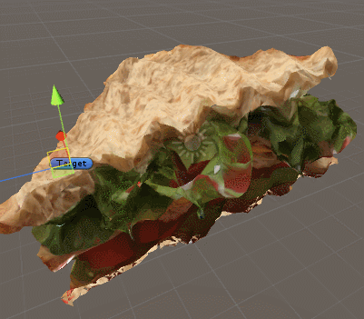
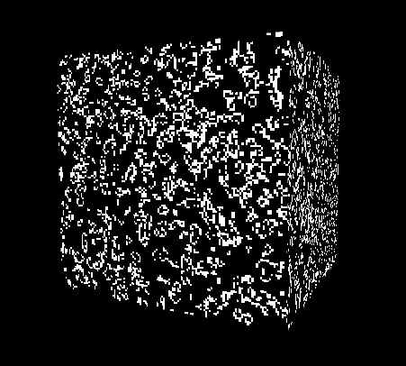
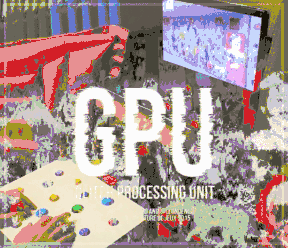
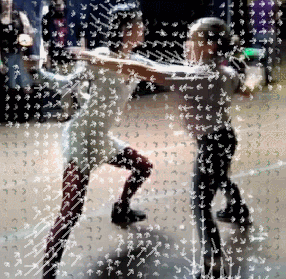
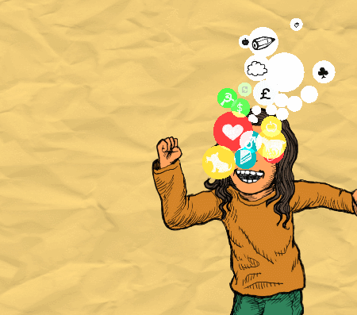
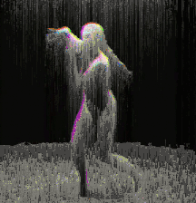
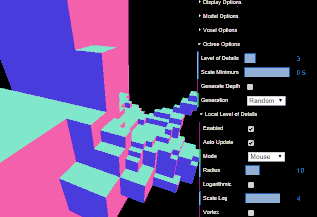
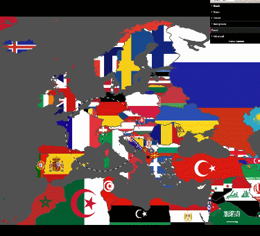

# General resources
- [The Book Of Shaders](https://thebookofshaders.com) by **Patricio Gonzalez Vivo** and **Jen Lowe**
- [Fragment shader lesson]( https://github.com/Jam3/jam3-lesson-webgl-shader-intro) by **Matt DesLauriers**
- [Vertex shader lesson](https://github.com/Jam3/jam3-lesson-webgl-shader-threejs) by **Matt DesLauriers**
- [Shadertoy tutorial](http://gamedevelopment.tutsplus.com/tutorials/a-beginners-guide-to-coding-graphics-shaders--cms-23313) by **Omar Shehata**
- [A giant list of open sources games](https://github.com/gloomyson/games)

# Unity3D shader resources

### Tutorials
- [A gentle introduction to shaders in Unity3D](http://www.alanzucconi.com/2015/06/10/a-gentle-introduction-to-shaders-in-unity3d/) by **Alan Zucconi**
- [Image filter tutorial](http://www.alanzucconi.com/2015/07/08/screen-shaders-and-postprocessing-effects-in-unity3d/) by **Alan Zucconi**

### References
- [Surface shader examples](http://docs.unity3d.com/Manual/SL-SurfaceShaderExamples.html)
- [Built-in shader variables](https://docs.unity3d.com/Manual/SL-UnityShaderVariables.html)
- [Blending](https://docs.unity3d.com/Manual/SL-Blend.html)
- [Culling & depth testing](https://docs.unity3d.com/Manual/SL-CullAndDepth.html)

### Resources

- [UnityList](http://unitylist.com/browse/effects)
- [Everything from](https://github.com/keijiro) **Keijiro Takahashi**
- [Effect Shader](https://github.com/inoook/EffectShader) by **dizgid**
- [Unity5 Effects](https://github.com/i-saint/Unity5Effects) by **i-saint**
- [AMAZE Live Audio Workshop](https://github.com/Spierek/AMAZE-Live-Audio-Workshop) by **Luke Spierewka**

# Raymarching resources

- [Raymarching tutorial]( http://9bitscience.blogspot.fr/2013/07/raymarching-distance-fields_14.html) by **uint9**
- [Articles]( http://iquilezles.org/www/index.htm) by **Inigo Quilez**
- [Raymarching on Unity5](https://github.com/i-saint/RaymarchingOnUnity5) by **i-saint**

# Open source projects from your teacher

## [Workshop Unity3D GLASS Summer School](https://github.com/leon196/GLASSSchool)

## 
## [Unity3D Time Displacement](https://github.com/leon196/TimeDisplacement)

## [Unity3D Tribute To Myst](https://github.com/leon196/MystJamGame)

## [Unity3D Glitch Processing Unit](https://github.com/leon196/GPU)

## [Optical Flow with Processing](https://github.com/leon196/OpticalFlowExample)

## [WebGL Choupichoup](https://github.com/leon196/Choupichoup)

## [WebGL Glitch TV](https://github.com/leon196/GPU/tree/master/GlitchTV)

## [WebGL Voxel Octree](https://github.com/leon196/Voxel/tree/master/WebGL)

## [WebGL drag and glitch project](https://github.com/leon196/DragAndGlitch)

## [WebGL demoscene for Evoke 2016](https://github.com/leon196/NaturallyUndead)

